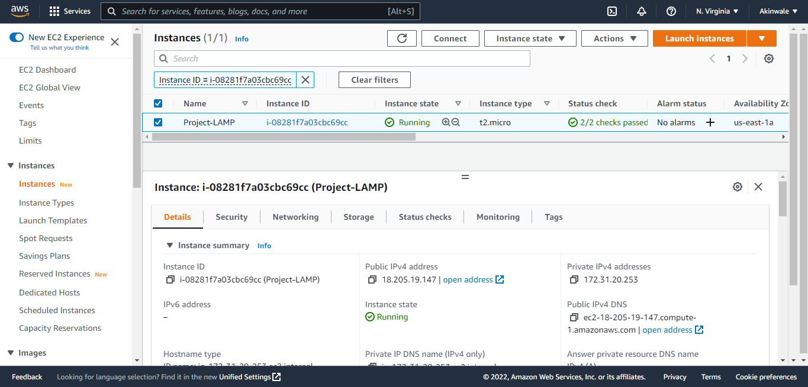
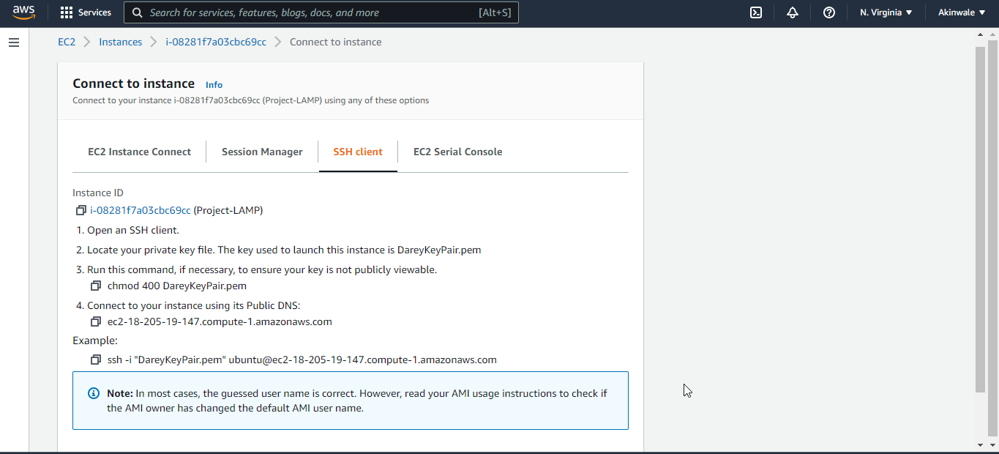
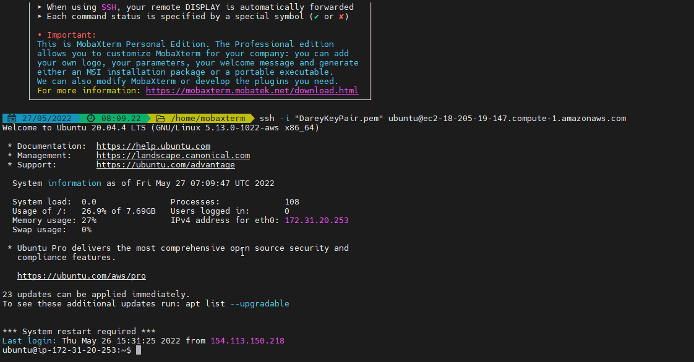
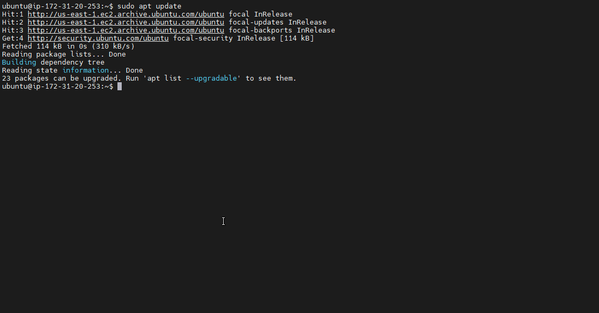
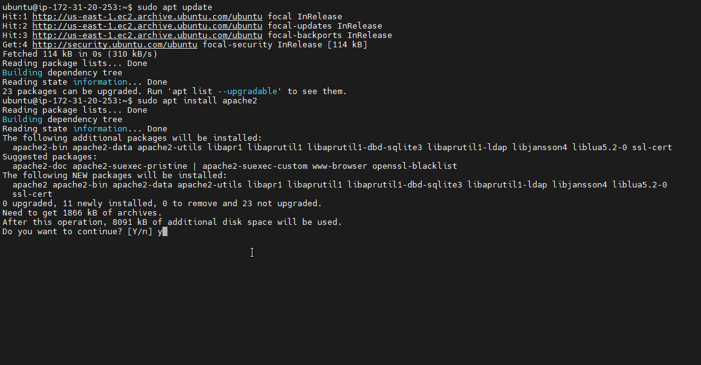
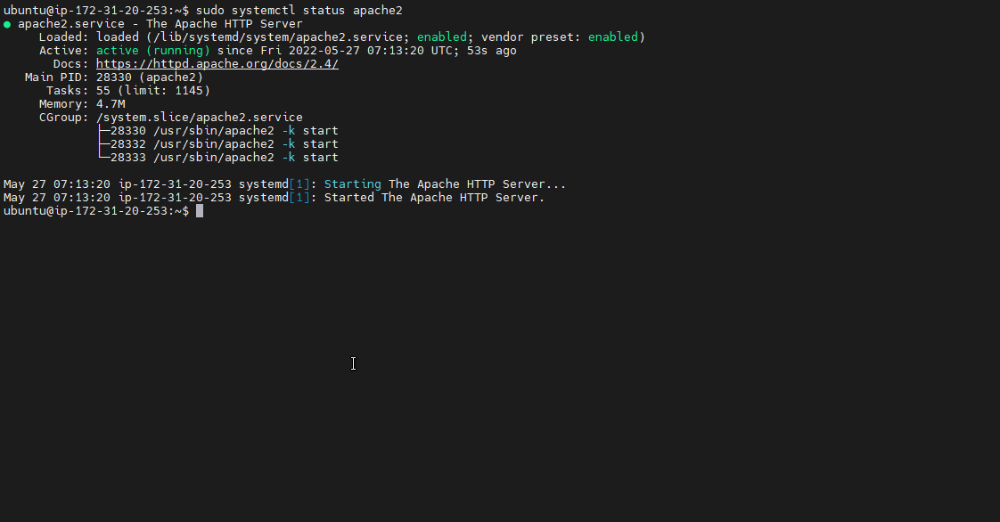

## My Project 1 Documentation LAMP

### Step 0

### AWS Account Setup and creating an ubuntu server name Project1-LAMP

### I Connect the ubuntu server using MobaXtern. 

### Connection successful using MobaXterm

## STEP 1 — INSTALLING APACHE AND UPDATING THE FIREWALL
## Install Apache using Ubuntu’s package manager

### update a list of packages in package manager

`sudo apt update`

### run apache2 package installation

`sudo apt install apache2`

### I verify that apache2 is running as a Service in my OS, using the following command

`sudo systemctl status apache2`

