## My Project 1 Documentation LAMP

### Step 0

### AWS Account Setup and creating an ubuntu server name Project1-LAMP

### I Connect the ubuntu server using MobaXtern. 

### Connection successful using MobaXterm

## STEP 1 — INSTALLING APACHE AND UPDATING THE FIREWALL
## Install Apache using Ubuntu’s package manager

### update a list of packages in package manager

`sudo apt update`

### run apache2 package installation

`sudo apt install apache2`

### I verify that apache2 is running as a Service in my OS, using the following command

`sudo systemctl status apache2`

### This is green which makes me to understand that I have install everything correctly 

### I go further to enable my port 80 to connect from the internet

## First, I check locally using my MobaXterm for successful html display using the comman below

` curl http://localhost:80
or
 curl http://127.0.0.1:80`

 ### The result display below

 

 ### I use my ubuntu public DNS and IP to check web display to confirm my apache 

 `ec2-18-205-19-147.compute-1.amazonaws.com`

 

 ## STEP 2 — INSTALLING MYSQL

 ### After the completion of my step one, I install MySQL database below are my codes and screen shot
## My Code 
 `sudo apt install mysql-server`

## Screenshot

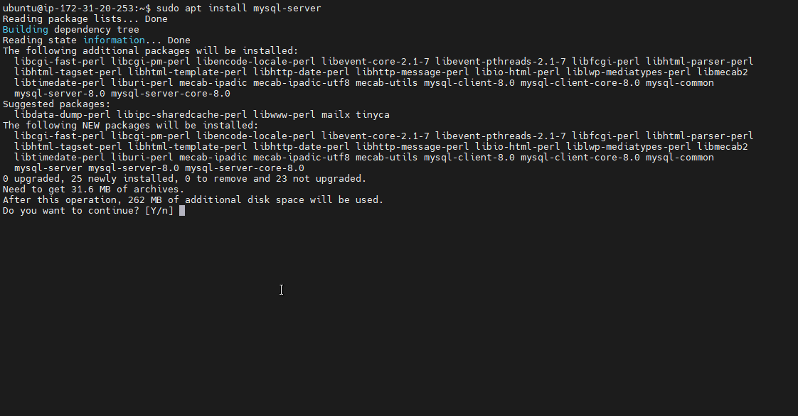

## login to MySql 

`sudo mysql`

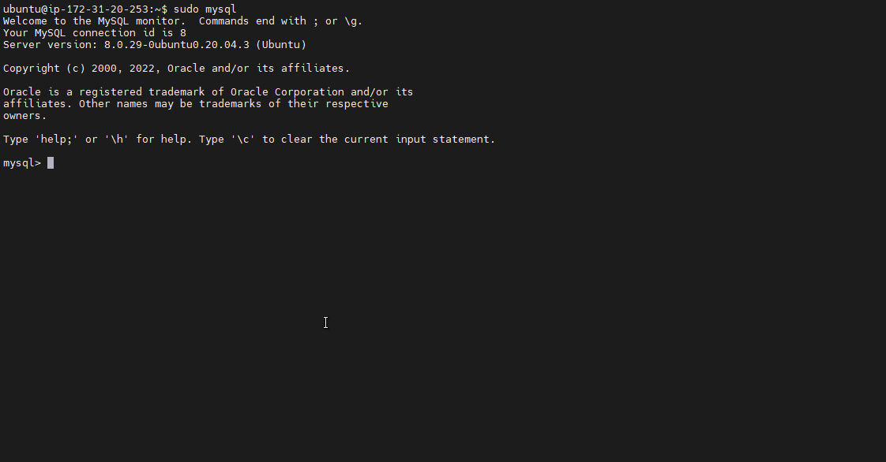

## MySQL Secure Installation

`sudo mysql_secure_installation`

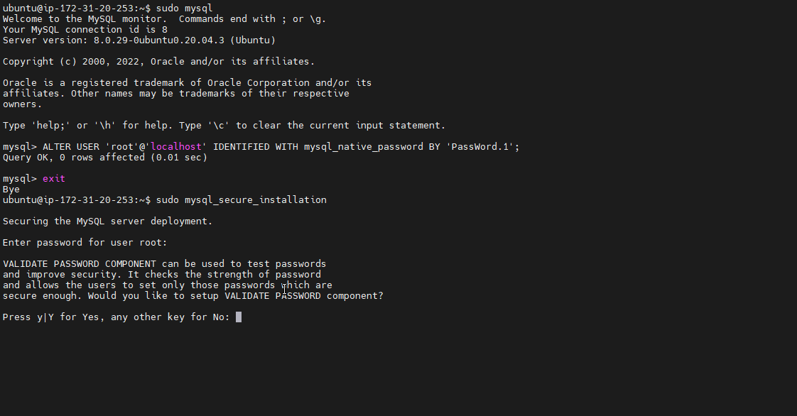

## MySql Validation

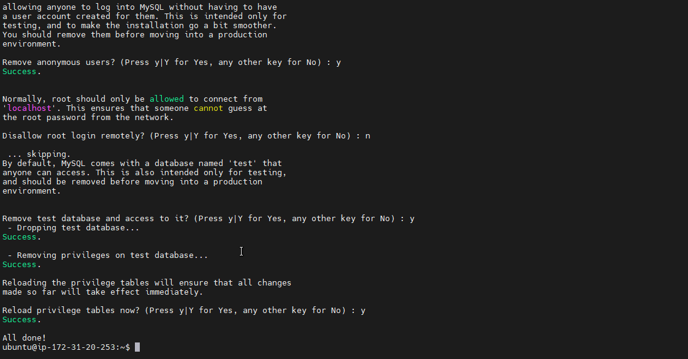

## Test to be able to log in to the MySQL console by typing
` sudo mysql -p`

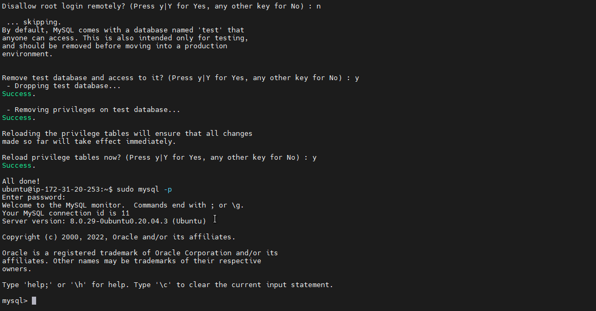

## STEP 3 — INSTALLING PHP

### PHP Installation: PHP is the component of our setup that will process code to display dynamic content to the end user. In addition to the php package, you’ll need php-mysql, a PHP module that allows PHP to communicate with MySQL-based databases. You’ll also need libapache2-mod-php to enable Apache to handle PHP files. Core PHP packages will automatically be installed as dependencies. To install these 3 packages at once, run:

`sudo apt install php libapache2-mod-php php-mysql`

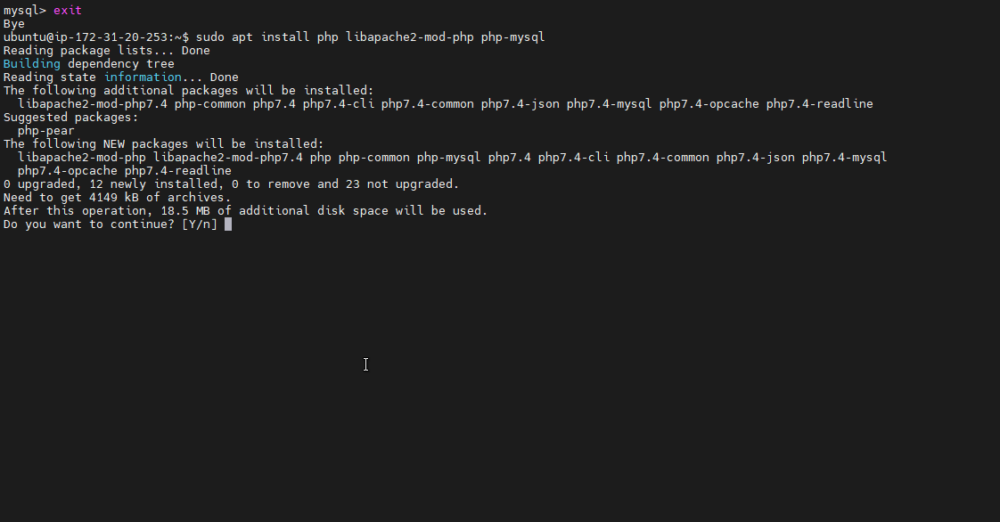

### PHP version confirmation 

`php -v`

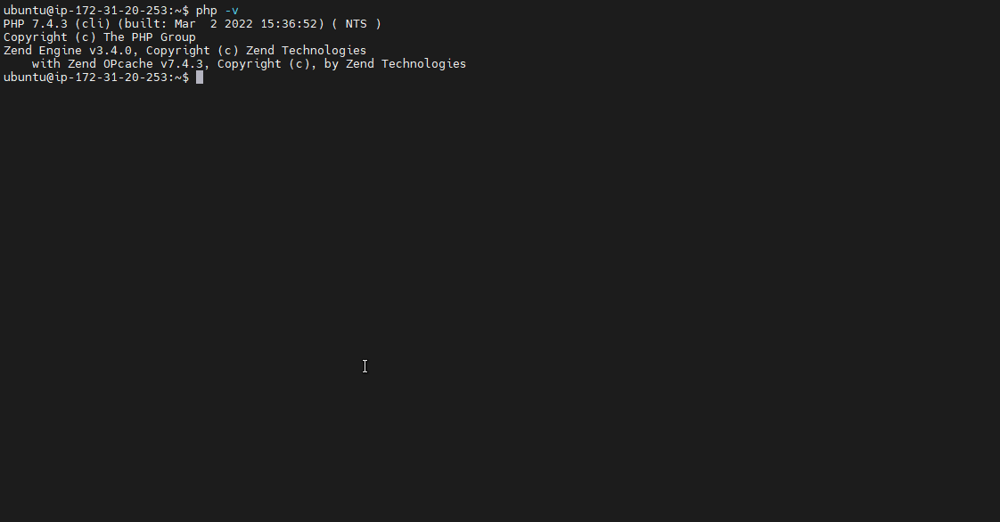

## STEP 4 — CREATING A VIRTUAL HOST FOR YOUR WEBSITE USING APACHE

#### In this step, I will set up a domain called projectlamp, Apache on Ubuntu 20.04 has one server block enabled by default that is configured to serve documents from the /var/www/html directory. I will leave this configuration as it is and will add my own directory next next to the default one.

#### I Create the directory for projectlamp using ‘mkdir’ command as follows:

`sudo mkdir /var/www/projectlamp`

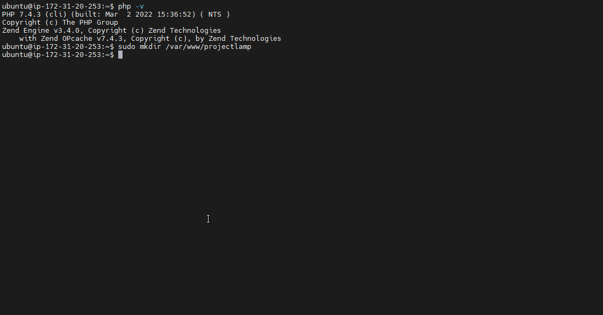

### Next, I assign ownership of the directory with my current system user

` sudo chown -R $USER:$USER /var/www/projectlamp`

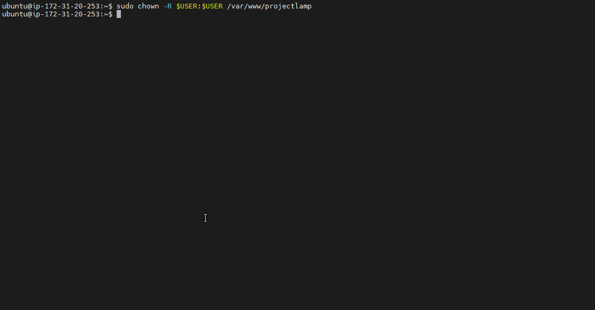

### Then, i create and open a new configuration file in Apache’s sites-available directory using my preferred command-line editor. Here, we’ll be using vi 

`sudo vi /etc/apache2/sites-available/projectlamp.conf`

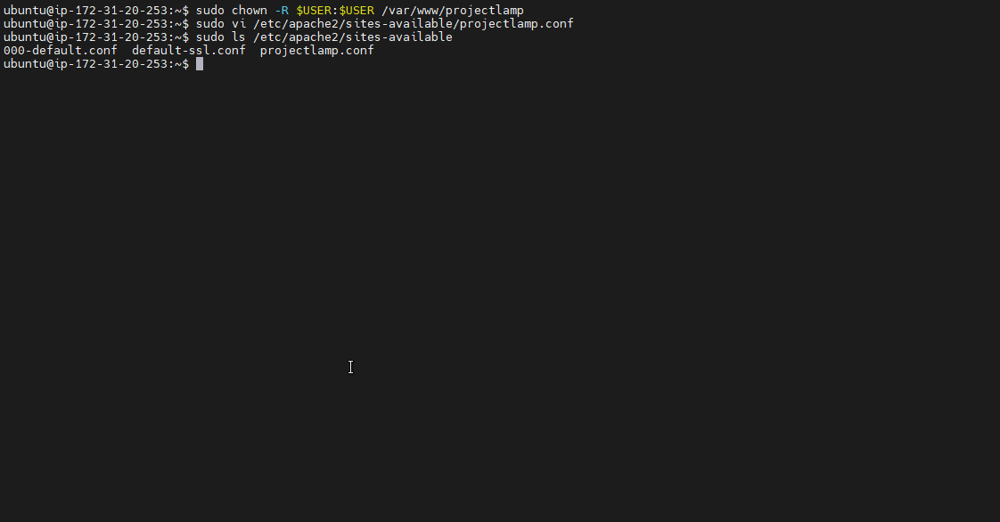

### I now use a2ensite command to enable the new virtual host:

`sudo a2ensite projectlamp`

### To disable Apache’s default website use a2dissite command , type:

`sudo a2dissite 000-default`

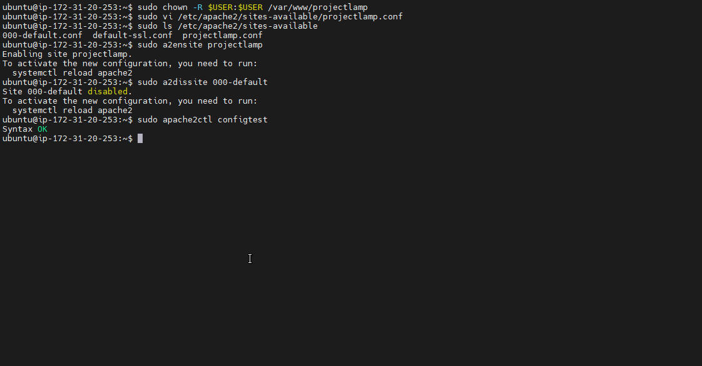

### To make sure your configuration file doesn’t contain syntax errors, run:

`sudo apache2ctl configtest`

### Finally, I reload Apache so these changes take effect:

`sudo systemctl reload apache2`

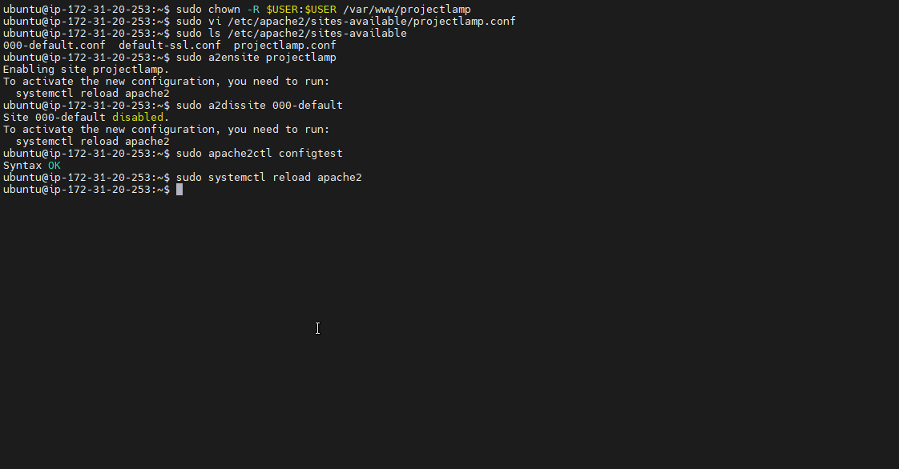

### My new website is now active, but the web root /var/www/projectlamp is still empty. I Create an index.html file in that location so that we can test that the virtual host works as expected:

`sudo echo 'Hello LAMP from hostname' $(curl -s http://169.254.169.254/latest/meta-data/public-hostname) 'with public IP' $(curl -s http://169.254.169.254/latest/meta-data/public-ipv4) > /var/www/projectlamp/index.html`

### Now I go to your browser and try to open your website URL using IP address:

`ec2-18-205-19-147.compute-1.amazonaws.com`

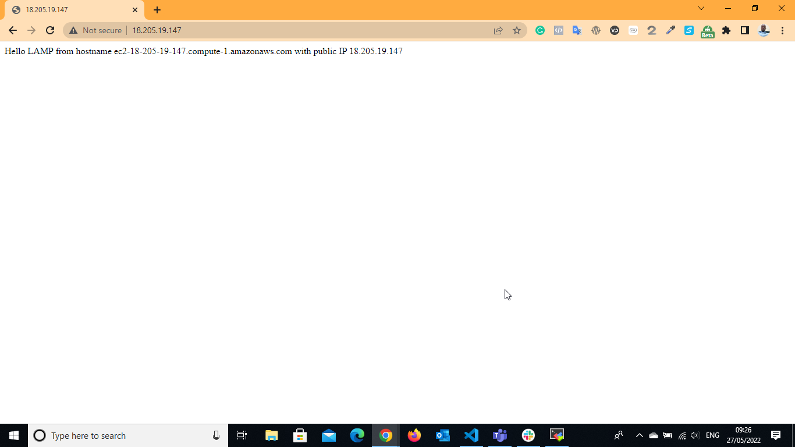

## STEP 5 — ENABLE PHP ON THE WEBSITE

#### With the default DirectoryIndex settings on Apache, a file named index.html will always take precedence over an index.php file. This is useful for setting up maintenance pages in PHP applications, by creating a temporary index.html file containing an informative message to visitors. Because this page will take precedence over the index.php page, it will then become the landing page for the application. Once maintenance is over, the index.html is renamed or removed from the document root, bringing back the regular application page. In case you want to change this behavior, you’ll need to edit the /etc/apache2/mods-enabled/dir.conf file and change the order in which the index.php file is listed within the DirectoryIndex directive:

`sudo vim /etc/apache2/mods-enabled/dir.conf`

`<IfModule mod_dir.c>
        #Change this:
        #DirectoryIndex index.html index.cgi index.pl index.php index.xhtml index.htm
        #To this:
        DirectoryIndex index.php index.html index.cgi index.pl index.xhtml index.htm
</IfModule>`

#### After saving and closing the file, I need to reload Apache so the changes take effect:

`sudo systemctl reload apache2`

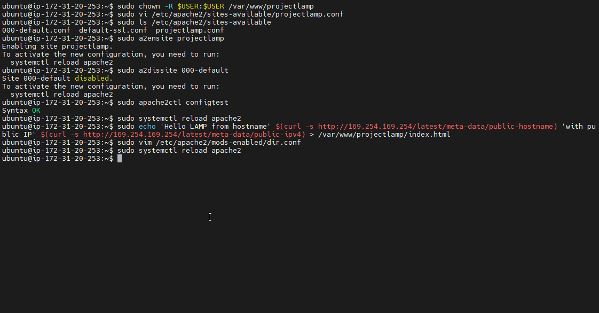

### Finally, I create a PHP script to test that PHP is correctly installed and configured on my server. Now that you I have a custom location to host my website’s files and folders, I’ll create a PHP test script to confirm that Apache is able to handle and process requests for PHP files. Create a new file named index.php inside your custom web root folder:

`vim /var/www/projectlamp/index.php`

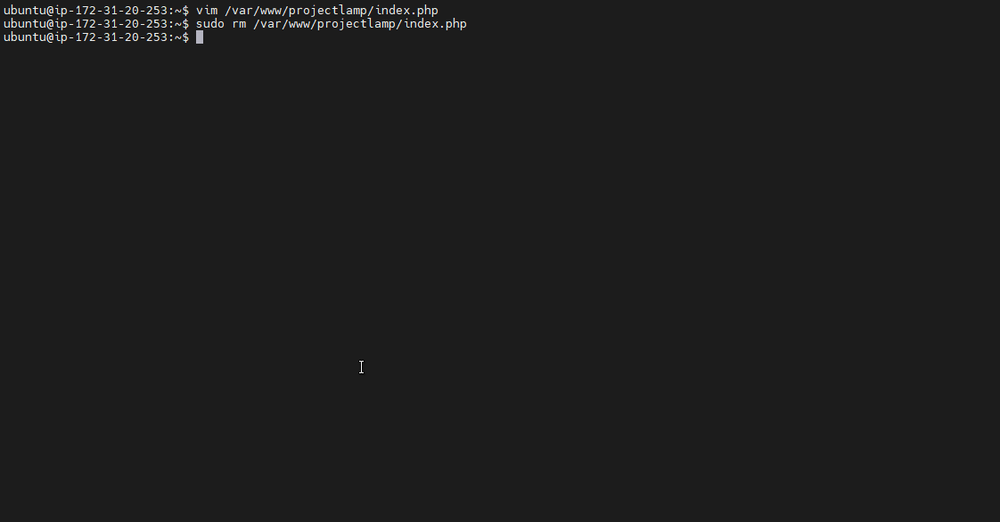

### I input the PHP code below

`<?php
phpinfo();`

### My final page display the PHP info document below:

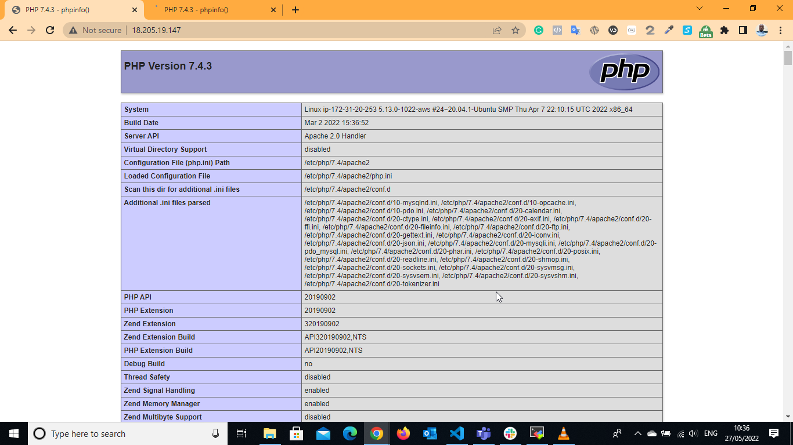

### Finally remove the info page using the below below

`sudo rm /var/www/projectlamp/index.php`

