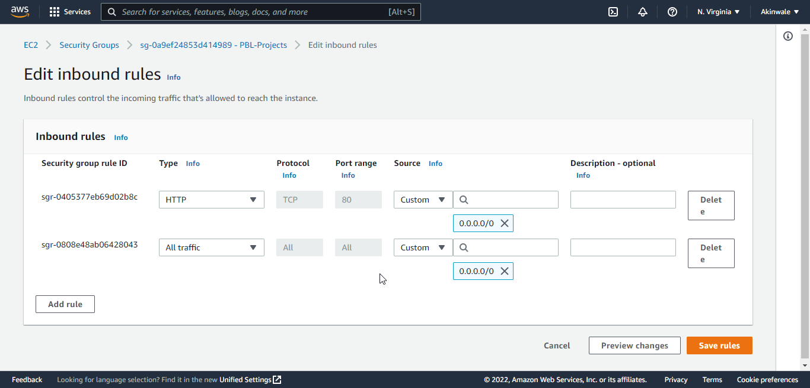
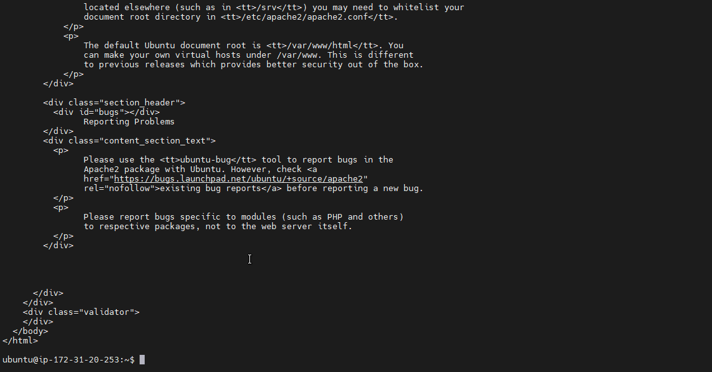
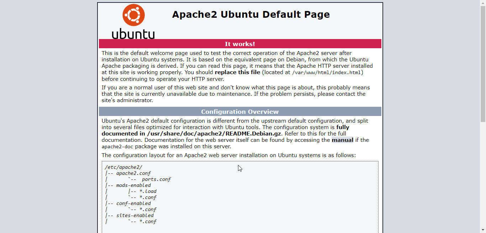

## My Project 1 Documentation LAMP

### Step 0

### AWS Account Setup and creating an ubuntu server name Project1-LAMP

### I Connect the ubuntu server using MobaXtern. 

### Connection successful using MobaXterm

## STEP 1 — INSTALLING APACHE AND UPDATING THE FIREWALL
## Install Apache using Ubuntu’s package manager

### update a list of packages in package manager

`sudo apt update`

### run apache2 package installation

`sudo apt install apache2`

### I verify that apache2 is running as a Service in my OS, using the following command

`sudo systemctl status apache2`

### This is green which makes me to understand that I have install everything correctly 

### I go further to enable my port 80 to connect from the internet

## First, I check locally using my MobaXterm for successful html display using the comman below

` curl http://localhost:80
or
 curl http://127.0.0.1:80`

 ### The result display below

 

 ### I use my ubuntu public DNS and IP to check web display to confirm my apache 

 `ec2-18-205-19-147.compute-1.amazonaws.com`

 

